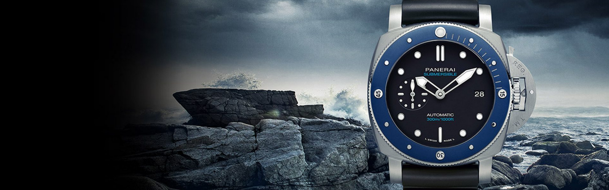
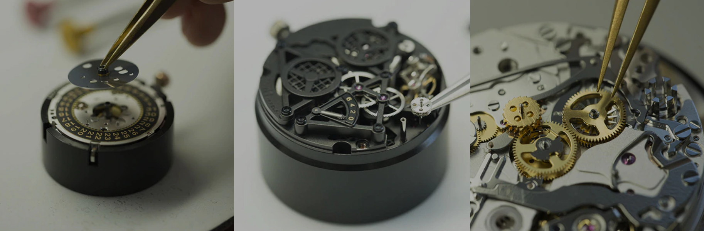

#**Show us your Panerai Watch!**

Welcome to this MVP created as final project at Ironhack Data Analysis course 2020.

Upon a image provided by you, it will try to identify if a watch belongs to Panerai or not and will provide some useful 
information if you are a true Paneristi.

## Project structure

This projects is intended to cover almost all the issues and tech we have studied along the course.

&nbsp;

> **Stage 1.- Identify is a watch image belongs to a certain watch brand (Panerai).**

- Get all the Panerai watches, images and info on sale at [Watchfinder](https://www.watchfinder.co.uk).
    - Around 280 items.
    - All the info (price, year, id ...) stored as dataframe.
    - Images saved and renamed with the id and model.
    
- Scraps [Chrono24](https://www.chrono24.com) by model, brand, etc  to get enough amount of labeled images.
    - 8184 images not Panerai vs 7731 Panerai images for further trainning.
    
- Using a transfer learning, starting with InceptionV3 convolutional neural network architecture, achieving god scores 
after trainning: 
    **loss: 0.0937 - accuracy: 0.9785** 
    
- You can find all info about this model on the notebook attached.

&nbsp;

> **Stage 2.- If the watch image is confirmed as a Panerai watch, make some suggestions based on aesthetic aspects.**

- Using as dataset the images fetched from Watchfinder (it is, watches that are on sale).

- Taking a VGG19 cnn and freezing the last layer, we can perform a feature extraction from each image on sale.
This results in a unique vector than represents the image and that can be simplified applying PCA.

- Passing a new image through our feature extractor and PCA reduction provides a new vector, which most similars ones 
can be found through cosine distance, resulting in a group with most similar preprocessed images of watches on sale.

&nbsp;

> **Stage 3.- Getting some more info about our choosen watch.**
   
- Starting from the watches selection offered and using the PAM (model reference in Panerai) of the choosen one,
we fetch some info using the PAM as #hashtag.

- Without using Instagram's API, we can obtain the last post, images and hashtags about the selected watch. 

- Performs an analysis about the used hashtags, comments sentiment through TextBlob and display the las images about the selected watch.

&nbsp;

> **Stage 4.- Getting all the pieces together.**

- Using Streamlit, we run a web app were it's possible to upload an image, check if it is a Panerai watch and if the
prediction is positive, get the 6 most similar watches on sale. Selecting any of it from this selection activates Instagram
scraping and displays all the info.

## Setting up the app

> Optional
- You can use C24_scraper to create a new dataset (this trained model is included in the repository, so itsn't necesary)

- If you want to update the watches on sale in Watchfinder, feel free to use WF_scraper included.

- Since VGG19 model is a very big file to be uploaded to GitHub, you can dowload it using the function *get_vgg19*, 
included in models_functions file.
- Also, you can execute get_VGG19.py sccript at models folder, wich will dowload the model to its folder. 
`python ./models/get_VGG19.py`

&nbsp;

> Running the app
- `streamlit run app.py` will launch the app on the browser.

&nbsp;

> Have fun!!
- Try with differents pictures, angles, brands, etc!

- Please, don't hesitate to contact me with any issue, suggestion, bugs and so!
It will be much appreciated  ^_^

- Keep in mind that this was made to learn and above all, to have fun.

&nbsp;

## Tech-stack:
- requests
- pandas
- beautifulsoup4
- matplotlib
- html5lib
- numpy
- tensorflow
- scikit-learn
- scipy
- streamlit
- pillow
- plotly
- wordcloud
- textblob

## Don't forget to visit [Panerai](https://www.panerai.com) ;)

## To be done:
- Guess what to do when there isn't any content in Instagram.
- Deploy the app (maybe Heroku or similar).

